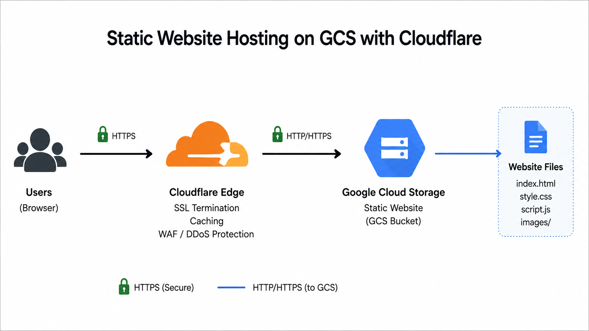

# Static Website Hosting on Google Cloud Storage (GCS) with Cloudflare

> A production-ready guide for hosting a static website on Google Cloud Storage using Cloudflare as the CDN, SSL provider, and reverse proxy.

## Architecture



### High-Level Flow

```text
User (HTTPS)
      │
      ▼
Cloudflare Edge
(SSL, CDN, Cache, WAF)
      │
      │ HTTP/HTTPS
      ▼
Google Cloud Storage Bucket
(Static Website)
```

---

# Prerequisites

- Google Cloud Project
- Billing enabled
- Cloud Storage API enabled
- Cloudflare-managed domain
- gcloud CLI installed and authenticated

---

# Step 1 – Create the Storage Bucket

> **Important:** The bucket name **must exactly match** your hostname.

Example:

```
www.example.com
```

```bash
export DOMAIN="www.example.com"

gcloud storage buckets create gs://$DOMAIN     --location=asia-south1
```

---

# Step 2 – Upload Website Files

```bash
gcloud storage cp index.html gs://$DOMAIN/index.html
```

Upload CSS, JS and images similarly.

---

# Step 3 – Configure Static Website

```bash
gcloud storage buckets update gs://$DOMAIN     --web-main-page-suffix=index.html
```

(Optional)

```bash
gcloud storage buckets update gs://$DOMAIN     --web-error-page=404.html
```

---

# Step 4 – Make Objects Public

```bash
gcloud storage buckets add-iam-policy-binding gs://$DOMAIN     --member=allUsers     --role=roles/storage.objectViewer
```

---

# Step 5 – Configure Cloudflare DNS

| Setting | Value |
|---------|-------|
| Type | CNAME |
| Name | www |
| Target | c.storage.googleapis.com |
| Proxy | Proxied (Orange Cloud) |
| TTL | Auto |

---

# Step 6 – Configure SSL

Cloudflare → **SSL/TLS**

- SSL Mode: **Full**
- Always Use HTTPS: Enabled
- Automatic HTTPS Rewrites: Enabled

---

# Step 7 – Verify

```bash
curl -I https://www.example.com
```

Expected:

- HTTP/2 200 OK
- server: cloudflare

---

# Updating Files

```bash
gcloud storage cp index.html gs://$DOMAIN/index.html
```

Then purge the Cloudflare cache if required.

---

# Troubleshooting

## 404

Bucket name doesn't match hostname.

## 403

Objects aren't publicly readable.

## Old Content

Purge Cloudflare cache.

---

# Alternatives

| Solution | Best For | Cost |
|----------|----------|------|
| GCS + Cloudflare | Static websites | ⭐ Very Low |
| Firebase Hosting | Static websites | Low / Free Tier |
| GitHub Pages + Cloudflare | Personal sites | Free |
| Cloud Run + Cloudflare | Dynamic apps | Pay per use |
| Compute Engine (Nginx) | Full web server | VM charges |
| HTTPS Load Balancer + GCS | Enterprise | Higher |

---

# Estimated Cost

| Service | Typical Cost |
|----------|--------------|
| Cloudflare Free Plan | $0/month |
| SSL Certificate | Included |
| Google Cloud Storage | Pay for storage + egress |
| Domain | Depends on registrar |

For most personal portfolios or documentation websites, the total monthly cost is typically only a few dollars unless bandwidth is very high.
